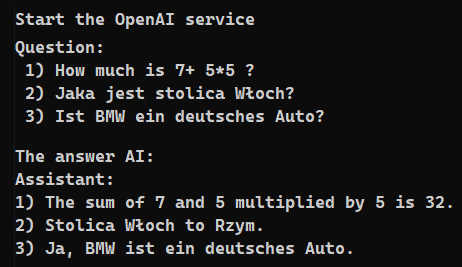
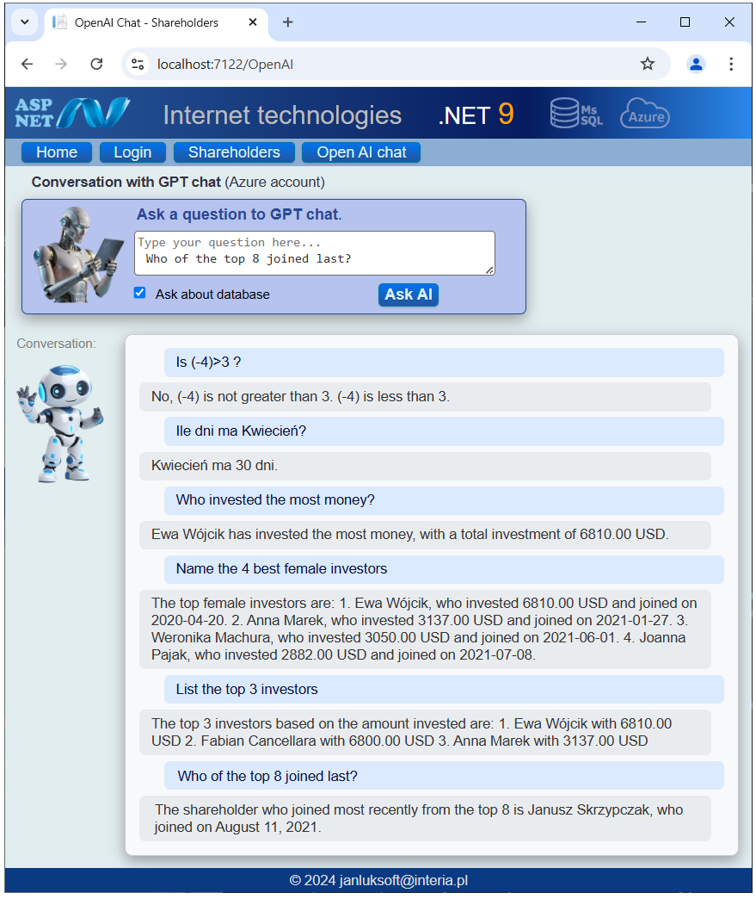

# Azure OpenAI Service

## Overview
Azure OpenAI Service is a Microsoftcloud service that gives you access to powerful AI models from OpenAI, like GPT-4, GPT-3.5, and Codex.

🔹 You can use these models for tasks such as:
- Text generation (e.g., chatbots, summarization, translation)
- Code generation and completion
- Data extraction and analysis
- Natural language search
- Image generation (if enabled)

It combines OpenAI’s advanced models with Azure’s security, scalability, and compliance.
You can also connect it to your own data using “Azure OpenAI on your data”.

## Sample Program 
The sample program works in the console and demonstrates simple use of the OpenAI service with Azure.

The Main function program sends a sample query in three languages ​​to the AI ​​and displays the received response in the console along with its structure.

The CAzureOpenAIUtils class is dedicated to connections with the OpenAI service. You must fill it in yourself because it contains confidential identifiers and parameters. You should use data from your Azure account on which the OpenAI service is active.

## Shareholders program with Chat GPT attached

Through libraries for .NET Chat GPT can be attached to any .NET application.

Based on the presented classes I wrote my [chat GPT] launched in a web browser. This chat can then be attached to various existing applications, significantly increasing their functionality.

Chat not only answers text questions but also supports the RAG (Retrieval-Augmented Generation) functionality. These are queries about your specific database that is open in the program. With properly asked questions you can obtain a lot of information about the available database.

Below is an example of communication.

